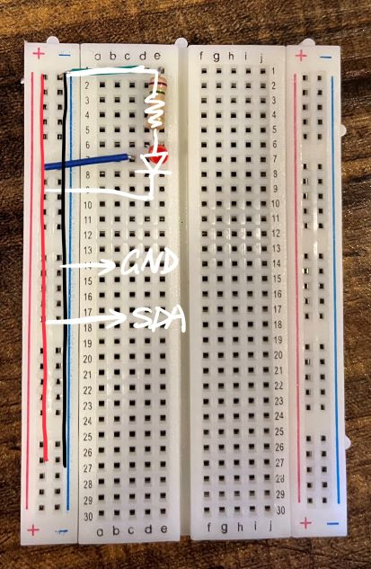

# Proposal for Lab2B

### LED action

### Proposal

I think in Lab 2B we are going to build a REPL bypassing the SDK, and directly get an access to the register. The REPL may have functions of read and write any register that we select.

### Required Material

For the LED part, we have already use a bread board, a resistor, and wires. Further in Lab 2B, I don't think there should be more thing needed.

